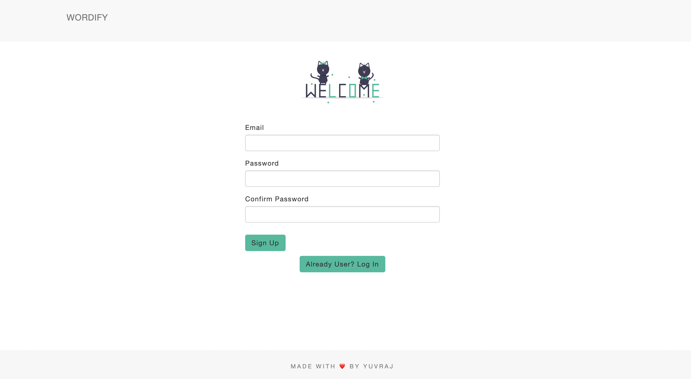
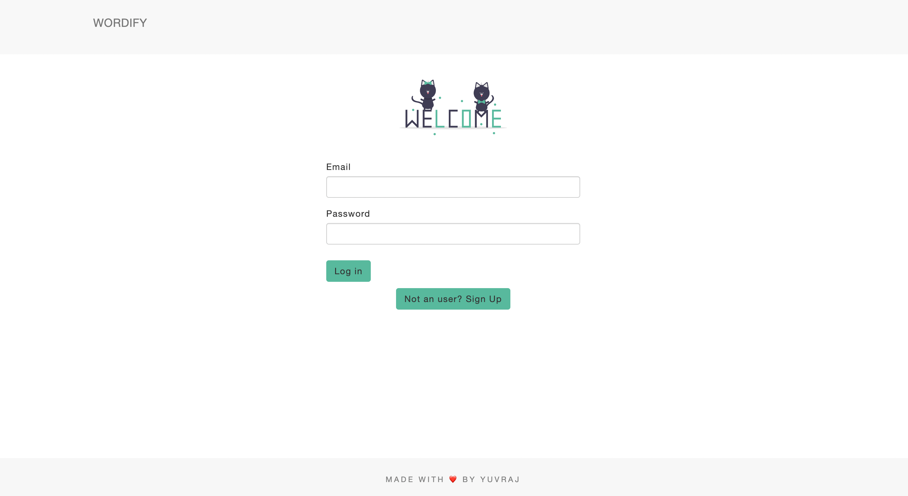
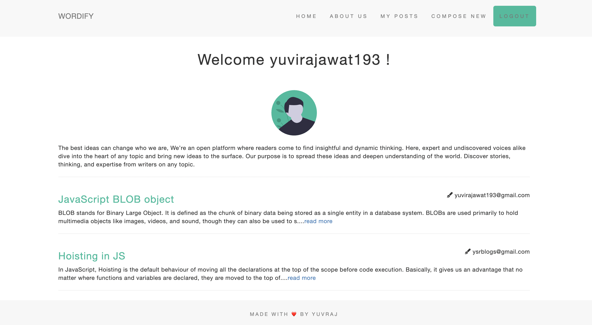
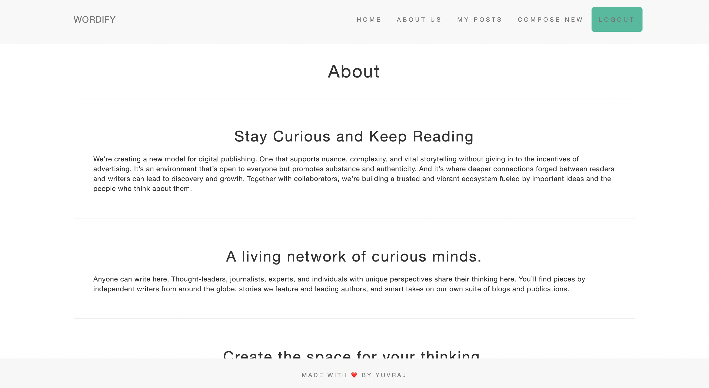
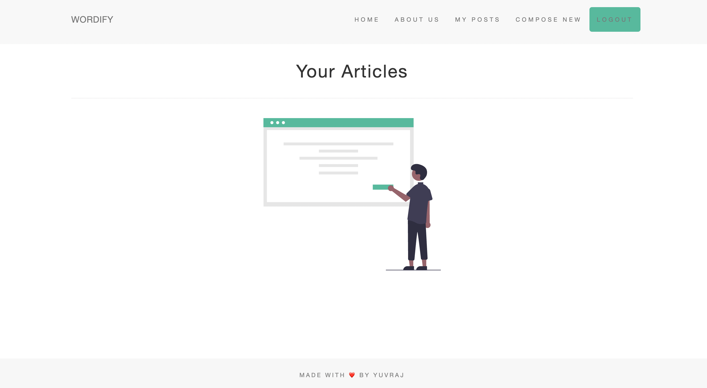
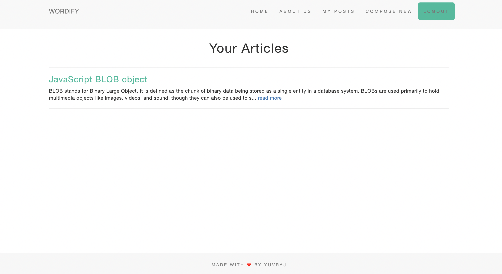
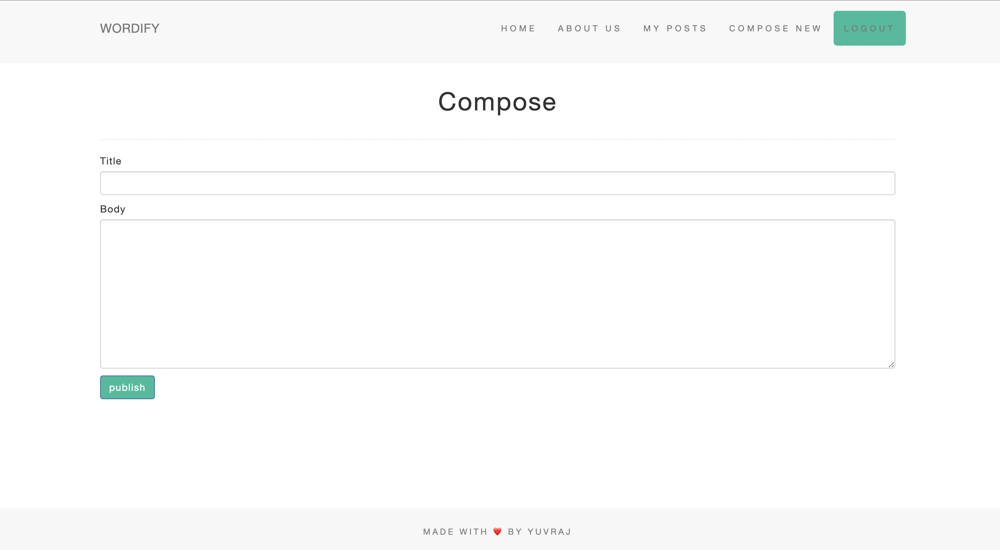
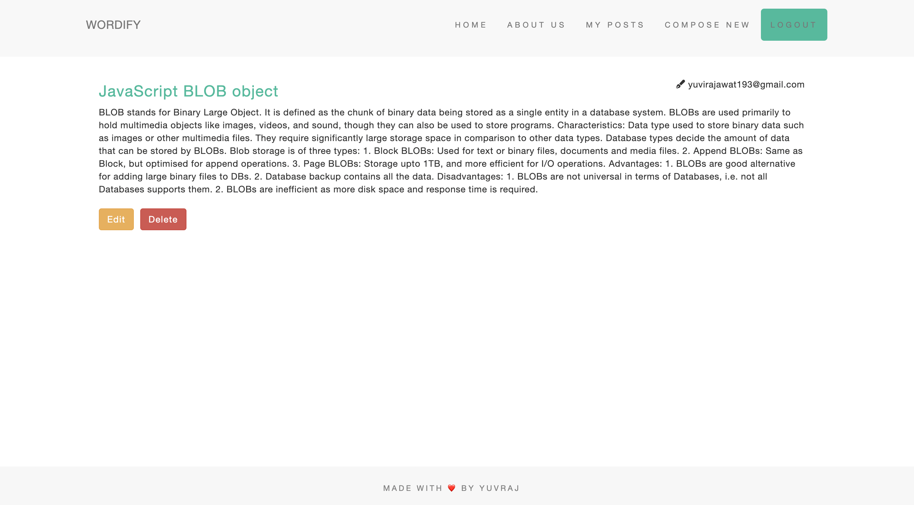
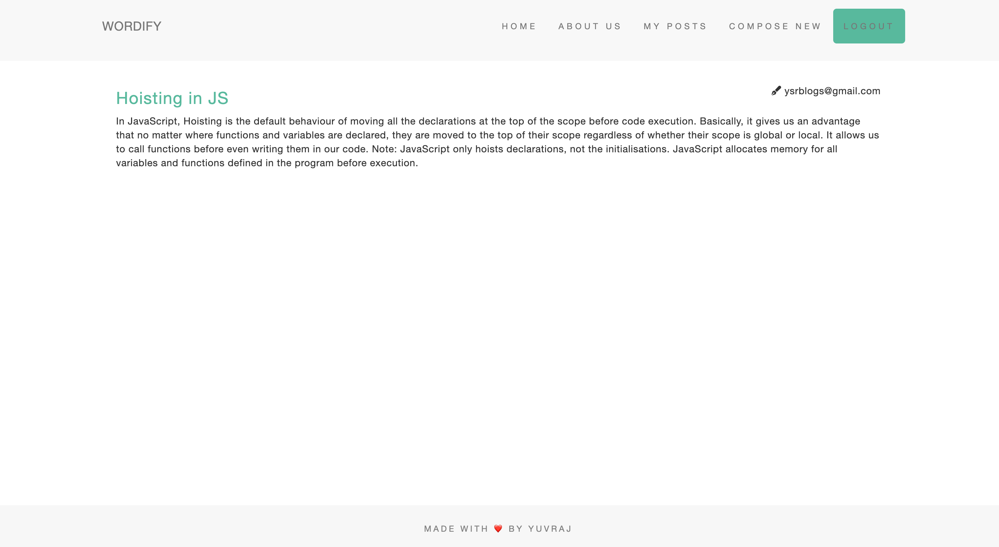

# WORDIFY

Designed and developed a publication based full stack web application that serves user top articles and authenticated users can publish their own articles and perform CRUD operations. Developed front end using EJS view engine snippets, DB operations are performed on mongoDB Atlas cluster and data validated using mongoose. Implemented authentication and session cookies using passport.js

# Demo

Please follow the link below about section or follow link below

<a href="https://www.youtube.com/watch?v=Qrj6x410CnM">Click here for Demo</a>

# Features

1. User lands on the sign up page where user can sign up or toggle to login if already an user. 
2. Navigation menu and header's visibility is hidden for unauthorized request.
3. Authentication is performed using Passport.js and its passport-local module.
4. On Authorised request user is redirected to the home page and nav bar is available.
5. On home page user is welcomed using his/her user name and all the articles are listed for reading.
6. User can land on particular post page using read more link.
7. Only read permission is allowed on posts written by other users.
8. User can read all posts, edit and delete self composed posts which user can find under my articles page.
9. On Logout user request is marked unauthorised and redirected to the sign up landing page.

# Tech

1. Backend: node.js and express
2. Frontend: HTML5, CSS3, JavaScript, EJS
3. Database: mongoDB
4. ODM: Mongoose
5. Authentication: Passport.js, passport-local
6. Session cookies: express-session
   
# Screenshots

1. sign up page: user can create profile 

2. Login page:

3. Home page: User welcomed with username and listed all articles

4. About Page:

5. My Posts Page:

On Zero Articles Published:

On Some Articles Published:

6. Compose Page: on compose redirected to my-posts page.

7. Post Page:

If Written by user:

Other person's post: Can't edit and delete.

   
